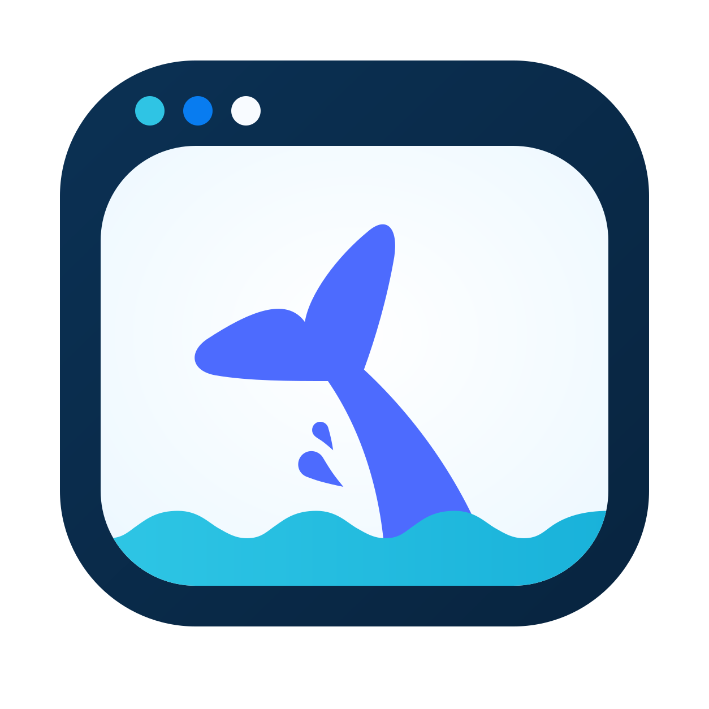
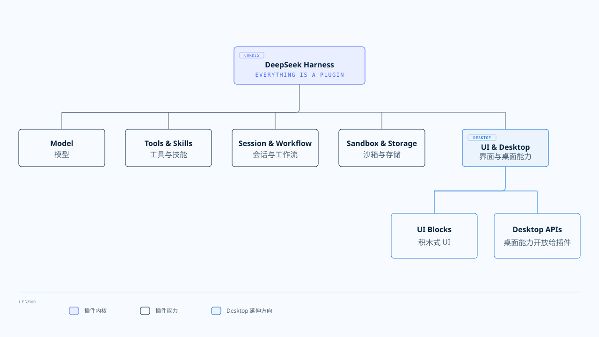
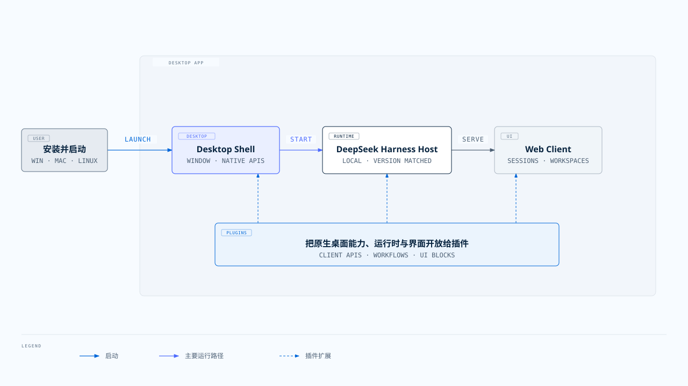

<div align="center">
  
  <h1>DeepSeek Harness Desktop</h1>
  <p>A more open DeepSeek Harness desktop app that extends the “everything is a plugin” philosophy to desktop capabilities, with all desktop capabilities customizable through plugins! Give us a ⭐ <a href="https://github.com/XLCYun/dsh-desktop">Star</a>!</p>
  <p><a href="./README.md">简体中文</a> · <a href="#download">Download</a> · <a href="#roadmap">Roadmap</a> · <a href="#contributing">Contributing</a></p>
</div>

## Overview

DeepSeek Harness Desktop is an install-and-go, cross-platform desktop application. Users do not need to install Node.js or start a service from the terminal.

## Why build a desktop version?

Desktop apps offer native capabilities that the web cannot replace, including global shortcuts, multiple windows, system tray integration, notifications, and floating widgets. Yet existing desktop apps are rarely open enough: these capabilities are usually reserved for the applications themselves.

**We want to carry forward the “everything is a plugin” philosophy by exposing desktop capabilities to plugins as well. Giving plugins direct access to them expands what DeepSeek Harness plugins can do.**

This project is in early development. The first runnable milestone is complete, while public distribution, code signing, and automatic updates are still planned.

## ⬇️ Download

Visit [GitHub Releases](https://github.com/XLCYun/dsh-desktop/releases) to download the latest version. Each release provides the following four packages; choose the one that matches your operating system and processor architecture:

| Platform | Suitable devices | Download |
| --- | --- | --- |
| Windows | 64-bit Intel / AMD | `windows-x64` |
| macOS | Apple silicon (M-series) | `macos-arm64` |
| macOS | Intel | `macos-x64` |
| Linux | 64-bit Intel / AMD | `linux-x64` |

## 🧩 Everything is a plugin

The central idea behind [DeepSeek Harness](https://www.deepseek.com/harness/) is that everything is a plugin. Agent capabilities such as models, tools, skills, sessions, sandboxes, storage, scheduling, and UI are composed from plugins.

DeepSeek Harness Desktop aims to carry this idea onto the desktop. We want Desktop to become a capability layer for plugins. It runs the client and exposes windows, shortcuts, notifications, floating widgets, and other desktop features for plugins to use directly. Its future block-based UI will let people add, move, and replace interface regions while the core stays small.



## ✨ What works today

✅ Windows x64, macOS arm64 and x64, and Linux x64 targets

✅ A bundled, version-matched DeepSeek Harness runtime with no system Node.js or Harness CLI requirement

✅ Automatic DeepSeek Harness Host startup and Web Client navigation in the same window

✅ Single-instance behavior that focuses the existing window on a second launch

✅ Startup recovery, redacted diagnostics, and access to the platform log directory

✅ Unit, real-Host integration, and an official Node + Harness smoke gate on every target platform

<a id="roadmap"></a>

## 🗺️ Roadmap

The roadmap will evolve with real-world feedback. These themes describe the current direction and do not promise a fixed delivery order.

### Coming up

| Direction | Plan |
| --- | --- |
| 🔌 Native desktop capabilities for plugins | Expose windows, shortcuts, tray integration, notifications, and floating widgets for plugins to call |
| 🧩 Block-based UI and themes | Add, move, and replace interface regions, save personal layouts, and customize color, typography, density, and window appearance |
| 💬 Faster access to conversations | Summon a lightweight chat window with a global shortcut and open different conversations in multiple windows |
| 🖥️ A fuller desktop experience | Add tray integration, background mode, native notifications, and transparent, always-on-top, click-through widgets for experiences such as desktop pets |
| 📱 LAN phone control | Use explicit authorization and secure pairing to turn a phone into a convenient desktop remote |
| 🧰 A better plugin experience | Ship useful default plugins, manage installation, activation, updates, and permissions, and let plugins contribute panels, toolbar actions, and desktop widgets |

Feature proposals and concrete use cases are welcome in [GitHub Issues](https://github.com/XLCYun/dsh-desktop/issues).

## How it fits together



Desktop owns the application lifecycle, security boundary, and operating-system integration. DeepSeek Harness Host runs locally and provides the service, while Web Client owns conversations and workspaces. Desktop will progressively expose native capabilities, the runtime, and interface regions for plugins to use.

## Development

Use Node.js 24 with Corepack enabled. The repository pins pnpm 11.7.0.

The first `pnpm dev` or `pnpm package` run downloads the fixed official Node 24 executable for the current target into `resources/node/<platform-arch>/node` (or `node.exe` on Windows). Existing executables are reused. Set `DSH_NODE_PATH` only when you intentionally need a runtime override; it never disables shipping the official executable.

```sh
git clone --recurse-submodules https://github.com/XLCYun/dsh-desktop.git
cd dsh-desktop
corepack pnpm install
corepack pnpm dev
```

Run the checks

```sh
corepack pnpm typecheck
corepack pnpm build
corepack pnpm test
corepack pnpm test:integration
corepack pnpm smoke:dsh-cli
```

Run the real desktop end-to-end suite. Windows, macOS, and Linux CI all use the embedded `@wdio/tauri-service` provider; Linux runs under Xvfb.

```sh
corepack pnpm test:e2e
```

## Packaging

Build on the native target platform.

```sh
corepack pnpm package
```

Artifacts are written to `src-tauri/target/release/bundle/`.

| Platform | Architecture | Format |
| --- | --- | --- |
| Windows | x64 | NSIS `.exe` |
| macOS | arm64, x64 | `.dmg` |
| Linux | x64 | `.AppImage` |

Current builds may be unsigned. On macOS, you may need to Control-click the app in Finder and choose **Open**. On Windows, SmartScreen may display a warning. Run artifacts only when you trust their source.

## Contributing

- Run type checking and relevant tests before submitting a change
- Share feature proposals and bugs in [GitHub Issues](https://github.com/XLCYun/dsh-desktop/issues)
- Treat `deepseek-harness/` as a read-only Git submodule
- Read [`docs/spec.md`](./docs/spec.md) and [`docs/adr/`](./docs/adr/) for design and implementation constraints

If you want desktop application UIs to be as adaptable as building blocks, you are welcome to help improve it.
